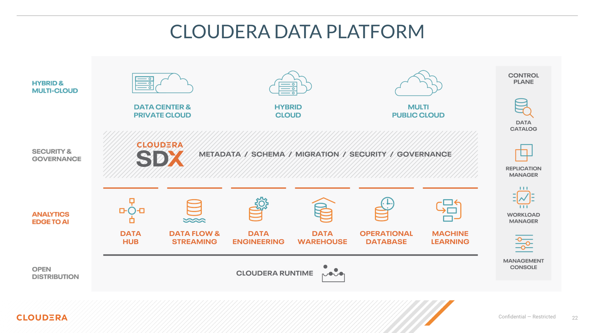
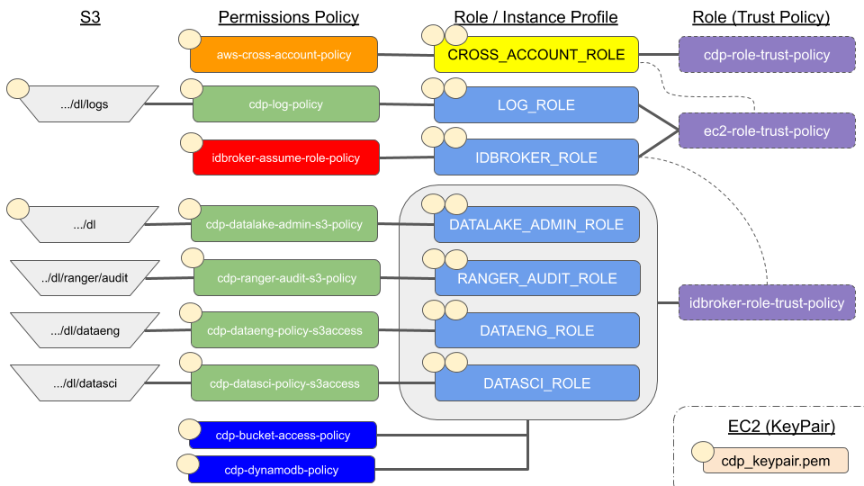

= Environment Deployment

=== What is CDP

* Besides a bunch of Open Source projects with funny link:https://docs.cloudera.com/runtime/7.0.3/release-notes/topics/rt-runtime-component-versions.html[zoo animal names]. +
Leave that to the link:https://zookeeper.apache.org/[Zookeeper].

Bsaically we have:

* All zoo animals as part of Cloudera runtime
* Package Cloudera runtime as parcel of Data center deployment
* Package runtime subcomponents  into use case driven groupings called experiences
** Experiences use K8s
** Need external stoarge either HDFS / S3 / ADLS / Ozone ( soon )
** Deployed in OpenShift for open prem ( called private cloud )
** Deployed as on EKS, AKS on cloud
* If there isn't an exerience to your linking
** Cloud has DataHub with a VM based deployment of components based on template

Experience Packaging ( may change in the future ):

* DataHub
** VM based catch all
* Data Flow
** Nifi
** Kafka
** Flink
* Data Engineering
** Hive
** Spark
* Data Warehouse
** Hive
** Impala
* Operational DB
** HBase
* Machine Learning
** Spark
** R

For on prem world see link:https://docs.cloudera.com/cloudera-manager/7.0.3/installation/topics/cdpdc-select-services.html[the documentation]

For all ths to work we need a Data Lake. Data lake is composed of

* Ranger
* ID Broker
* FreeIPA
* Atlas

All this is controlled from the control plane, single deployment by Cloudera in our
own private space where clients access via web portal

=== Deployment Process for Cloud

1. Deploy Environment = Data Lake
1. Setup stoarge in S3 an permissions as needed
1. Deploy experiences / datahub as needed for data processing / use

Data lakes are usually long lived, experinces should be on for as long as it takes to complete the tasks.
For long lived cluster on premises might be more cost effective.

=== AWS Concepts we need to understand

* IAM
** link:https://docs.aws.amazon.com/IAM/latest/UserGuide/id_roles.html[AIM Role]
** link:https://docs.aws.amazon.com/IAM/latest/UserGuide/access_policies.html[AIM Policy]
*** link:https://docs.aws.amazon.com/medialive/latest/ug/about-trusted-entity.html[Trusted entity]
*** Permission
*** link:https://docs.aws.amazon.com/IAM/latest/UserGuide/id_roles_common-scenarios_aws-accounts.html[Cross Account]
* link:https://en.wikipedia.org/wiki/Amazon_S3[S3 Bucket]
* AWS assume role
* DynamoDB for link:https://docs.cloudera.com/cloudera-manager/7.0.3/managing-clusters/topics/cm-s3guard.html[s3 guard]
* link:https://docs.aws.amazon.com/general/latest/gr/aws-arns-and-namespaces.html[ARN]
* link:https://docs.aws.amazon.com/IAM/latest/UserGuide/tutorial_cross-account-with-roles.html[Cross account role]

== Data Lake Deployment

General view of what needs to be done

Useful Resouces:

link:https://docs.google.com/document/d/1BTTrZ7NijD-xCrlg1YYfHBDjN3KYLEKku3b3sOZ5En4/edit#[CDP Deployment Cheat Sheet Doc]

link:https://docs.cloudera.com/management-console/cloud/environments/topics/mc-edit-idb-mappings.html[[CDP Deployment Public Doc]

