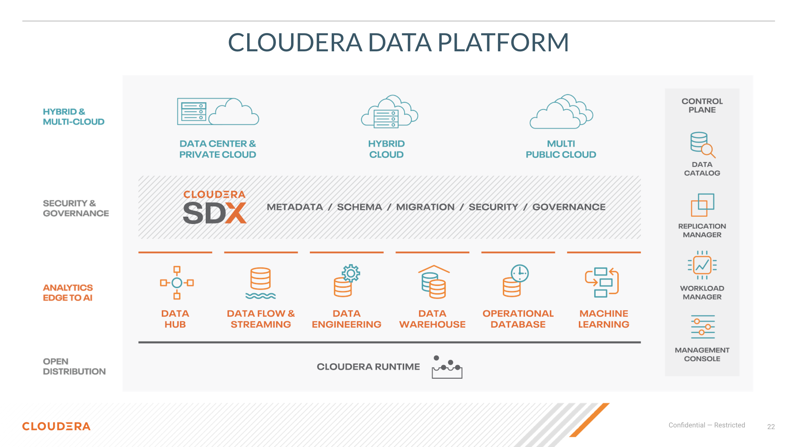
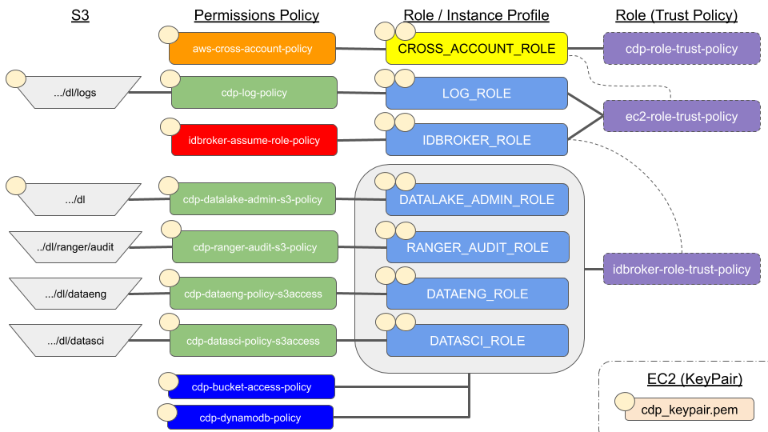

= Environment Deployment

=== What is CDP

* Get away from zoo animals, too granular and confusing

Bsaically we have:

* All zoo animals as part of Cloudera runtime
* Package Cloudera runtime as parcel of Data center deployment
* Package runtime subcomponents  into use case driven groupings called experiences
** Experiences use K8s
** Need external stoarge either HDFS / S3 / ADLS / Ozone ( soon )
** Deployed in OpenShift for open prem ( called private cloud )
** Deployed as on EKS, AKS on cloud

Experience Packaging ( may change in the future ):

* DataHub
** VM based catch all
* Data Flow
** Nifi
** Kafka
** Flink
* Data Engineering
** Spark
* Data Warehouse
** Hive
** Impala
* Operational DB
** HBase
* Machine Learning
** CDSW

=== Deployment Process for Cloud

1. Deploy Environment = Data Lake
1. Setup stoarge in S3 an permissions as needed
1. Deploy experiences / datahub as needed for data processing / use

=== AWS Concepts we need to understand

* IAM
** link:https://docs.aws.amazon.com/IAM/latest/UserGuide/id_roles.html[AIM Role]
** link:https://docs.aws.amazon.com/IAM/latest/UserGuide/access_policies.html[AIM Policy]
*** link:https://docs.aws.amazon.com/medialive/latest/ug/about-trusted-entity.html[Trusted entity]
*** Permission
*** link:https://docs.aws.amazon.com/IAM/latest/UserGuide/id_roles_common-scenarios_aws-accounts.html[Cross Account]
* link:https://en.wikipedia.org/wiki/Amazon_S3[S3 Bucket]
* AWS assume role
* DynamoDB for link:https://docs.cloudera.com/cloudera-manager/7.0.3/managing-clusters/topics/cm-s3guard.html[s3 guard]
* link:https://docs.aws.amazon.com/general/latest/gr/aws-arns-and-namespaces.html[ARN]

== Data Lake Deployment

General view of what needs to be done

Useful Resouces:

link:https://docs.google.com/document/d/1BTTrZ7NijD-xCrlg1YYfHBDjN3KYLEKku3b3sOZ5En4/edit#[CDP Deployment Cheat Sheet Doc]

link:https://docs.cloudera.com/management-console/cloud/environments/topics/mc-edit-idb-mappings.html[[CDP Deployment Public Doc]

Exercise 1

Deploy a data lake :)
