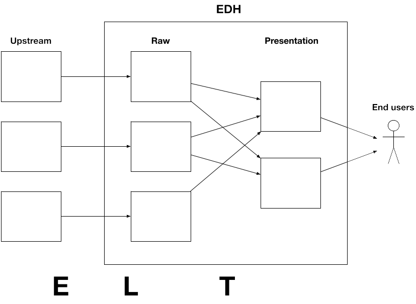

= Ingestion

First things first, let's get data

Traditional Data Patterns usually follow the following pattern:

1. Ingestion
1. Transformation
1. Consumption.

The first 2 steps are often referred to as ETL ( Extract Transform and Load ). This is a misnomer,
as intermediate platforms for data transformation are falling out of favor. Today we mostly practice ELT.

In Big Data, ingestion of raw data is recommended as is, as to eliminate the risks of:

* Loss of precision
* Loss of granularity
* Data corruption during format changes
* Allows for replay of transformation as needed

Once data is in Hadoop it is often transformed for presentation. Raw data can be used for
infrequent scanning, but should be optimized when working with frequent scans

=== Ingestion Types

Usually we deal with 3 different types of ingestions:

1. Files
1. RBDMS
1. Streaming

If you are dealing with Banks you might also have Mainframe / EBCDIC / Really Old Stuff.

Usually we bring in a partner for that, unless it's really simple ( It never is )

1. Ask about link:https://www.ibm.com/support/knowledgecenter/en/SS6SG3_4.2.0/com.ibm.entcobol.doc_4.2/PGandLR/ref/rlddered.htm[Redefines ]
   watch everybody shiver. Call in a partner.
1. Go back to step 1.

=== File Ingestion

At it's core a 2 step process:

* make the data visible to the cluster
** One solution is NAS / SAN storage
** Other place data on edge node
* Copy the data into HDFS location
** with Nifi ( GetFile and PutHDFS processors )
** with "hdfs dfs -put"

Enterprise schedulers can facilitate both steps, e.g. Autosys / Control-M

TIP: When dealing with text file, it's very important to check for delimiter corruption.

=== RDBMS Ingestion

Two Basic Tools

1. Sqoop

** Just a CLI, no install required, no long-running processes
** Runs a MapReduce job that opens a JDBC connection per mapper
** Has wide RDBMS support and many options for how to land data in HDFS
** Can also export back to RDBMS

1. NiFi

** Much better tools with options for pushing data to many targets
** Use QueryDatabaseTable for data extraction.
** Divide and conquer for larger tables
** link:https://community.cloudera.com/t5/Community-Articles/RDBMS-to-Hive-using-NiFi-small-medium-tables/ta-p/244677[Blog on Nifi with small table extract]

==== Let's talk CDC ( Change Data Capture )

To be able to do CDC ( grab only new records ), you need to be able to determine what data is new.

We have no magic, we need the source system to help.

You basically have 3 options

1. Triggers

** Every insert copies the record into a "New Data" table.
** Nobody ever accepts the performance degradation of implementing this.

1. Special Data

** The data model need to have a timestamp or some record you can use to place in a where clause
to pull only the new records.
** If it's not there already you are not going to convince the customer to change the data model for your CDC

1. Pull Everything

** If the above 2 are not options, pull all data into Hadoop and diff against existing data, and you have
   new records
** Yes this does pull a lot of strain on source systems.

=== NiFi

General purpose data integration tool

image::png/nifi.png[ nifi ]

* Works well in our stack for ingesting from upstream systems
* Pipelines defined with a GUI
* Can also do per-record processing
* Not suitable for most cross-record processing, e.g. joins, aggregations
* Primarily used for streams, but can ingest batches too
* Deployed using Cloudera Manager via separate parcel

