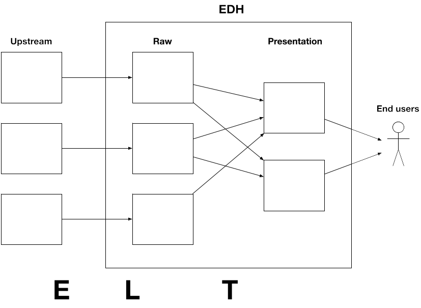

= Ingestion

First things first, let's get data

Traditional Data Patterns usually follow the following pattern:

1. Ingestion
1. Transformation
1. Consumption.

The first 2 steps are often referred to as ETL ( Extract Transform and Load ). This is a misnomer,
as intermediate platforms for data transformation are falling out of favor. Today we mostly practice ELT.

In Big Data, ingestion of raw data is recommended as is, as to eliminate the risks of:

* Loss of precision
* Loss of granularity
* Data corruption during format changes
* Allows for replay of transformation as needed

Once data is in Hadoop it is often transformed for presentation. Raw data can be used for
infrequent scanning, but should be optimized when working with frequent scans

=== Ingestion Types

Usually we deal with 3 different types of ingestions:

1. Files
1. RBDMS
1. Streaming

If you are dealing with Banks you might also have Mainframe / EBCDIC / Really Old Stuff.

Usually we bring in a partner for that, unless it's really simple ( It never is )

1. Ask about link:https://www.ibm.com/support/knowledgecenter/en/SS6SG3_4.2.0/com.ibm.entcobol.doc_4.2/PGandLR/ref/rlddered.htm[Redefines ]
   watch everybody shiver. Call in a partner.
1. Go back to step 1.

=== File Ingestion

At it's core a 2 step process:

* make the data visible to the cluster
** One solution is NAS / SAN storage
** Other place data on edge node
* Copy the data into HDFS location
** with Nifi ( GetFile and PutHDFS processors )
** with "hdfs dfs -put"

Enterprise schedulers can facilitate both steps, e.g. Autosys / Control-M

TIP: When dealing with text file, it's very important to check for delimiter corruption.

=== RDBMS Ingestion

Two Basic Tools

1. Sqoop

** Just a CLI, no install required, no long-running processes
** Runs a MapReduce job that opens a JDBC connection per mapper
** Has wide RDBMS support and many options for how to land data in HDFS
** Can also export back to RDBMS

1. NiFi

** Much better tools with options for pushing data to many targets
** Use QueryDatabaseTable for data extraction.
** Divide and conquer for larger tables
** link:https://community.cloudera.com/t5/Community-Articles/RDBMS-to-Hive-using-NiFi-small-medium-tables/ta-p/244677[Blog on Nifi with small table extract]

==== Let's talk CDC ( Change Data Capture )

To be able to do CDC ( grab only new records ), you need to be able to determine what data is new.

We have no magic, we need the source system to help.

You basically have 3 options

1. Triggers

** Every insert copies the record into a "New Data" table.
** Nobody ever accepts the performance degradation of implementing this.

1. Special Data

** The data model need to have a timestamp or some record you can use to place in a where clause
to pull only the new records.
** If it's not there already you are not going to convince the customer to change the data model for your CDC

1. Pull Everything

** If the above 2 are not options, pull all data into Hadoop and diff against existing data, and you have
   new records
** Yes this does pull a lot of strain on source systems.

=== Query the data

Basically the process of taking data out of the cluster

Not necessarily the same data model as what was ingested:
* Strive for the best user experience possible
* Balance coverage, performance, and simplicity

Transforming/processing data upfront can make querying better
* Use Hive or Spark for this process
* Trade off, ease of ingestion vs easy of consumption.

=== Data Modeling

* Tables
* Partitions
* File formats
* Compression
* Data types
* Statistics
* Caching

Advanced data modeling discussion: link:http://tiny.cloudera.com/datamodelingtalk_link[ Data Modeling ]

==== SQL

SQL has been around for decades and is very well known.
Not always the best tool, but the most universal.

* Allows access to the cluster’s data without any programming
* Used by many code-gen tools, BI ETL etc.

Impala is our SQL engine for end user data access
* Much faster than Hive for analytics queries
* Written from scratch in C++, no MapReduce or Spark under the hood
* Provides standard JDBC/ODBC interfaces
* More sensitive to custer instability use Hive for ETL workloads.

Alternative Hive LLAP (Live Long And Process) - HDP and CDP
* Hybrid execution model
* Pre-fetching and caching, JIT optimizations, etc…

=== Other query tools

Search

* Solr

Key lookups

* HBase, Kudu

Bulk extracts

* Hive, hdfs dfs –get, etc.

Data science

* CDSW (R, Python, Scala)

=== Before You Start

* link:../README.adoc[Follow instructions here] and link:../README_GitHub.adoc[here] if you haven't already
* Remember to submit text-based work in AsciiDoc and screenshots as PNG files
** Use code formatting (``...``) at a minimum
* Create an Issue in your repo called `Installation Lab`
** Add it to the `Labs` milestone
** Assign the label `started`
* Use the issue to note your lab progress
** Add a comment when you have finished a lab section
** Add a comment if you run into a puzzling error or other blocker
** If you also fix it a problem, comment on the cause and solution

=== Exercise 1

Create an Issue called Ingestion labs
* Add it to the Lab milestone
* Label the issue as started
* Assign yourself to the Issue

Develop the commands to ingest measurements and reference data from Oracle into your cluster using Sqoop.
You can use degree of parallelism 1 for your initial job.

Use the cluster that you have been assigned. Check slack for details of the cluster
and the Oracle connection string and credentials

The Data: 500 million measurements, 8 detectors, 128 galaxies, 106 astrophysicists
The Tables: measurements, detectors, galaxies, astrophysicists

Make the tables available to Impala for querying in Hue

Put the sqoop command used in the file labs/sqoop.adoc

=== Exercises 2

Expand the ingestion sqoop command making the following improvements:

1. Increase the degree of parallelism to 6 parallel threads
1. Write the data into snappy parquet format
1. Ingest multiple tables in parallel

Place the new sqoop command in the file labs/parallel_sqoop.adoc

=== Exercises 3

Let's make some Hive constructs 

1. Create a view simplify the presentation data model Pre-join reference tables

Next write SQL query that create additional tables to speed up the presentation data model
Materialize the views and also convert DOUBLEs to DECIMALs

Place the create view and create table SQL in the file labs/hive.adoc

Label your Issue review
