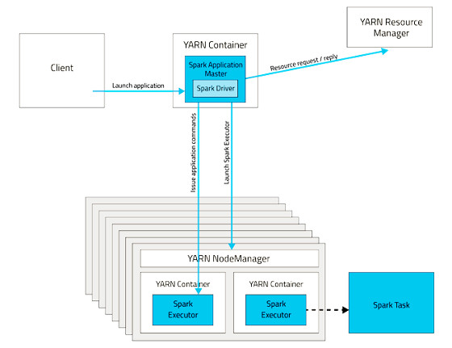
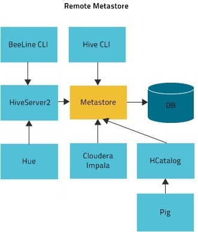

== Data Engineering

Some people might still call it ETL, though ETL also encompasses ingestion
and it a bit of an older concept

=== Query the data

Basically the process of taking data out of the cluster

Not necessarily the same data model as what was ingested:
* Strive for the best user experience possible
* Balance coverage, performance, and simplicity

Transforming/processing data upfront can make querying better
* Use Hive or Spark for this process
* Trade off, ease of ingestion vs easy of consumption.

=== Data Modeling

* Tables
* Partitions
* File formats
* Compression
* Data types
* Statistics
* Caching

Advanced data modeling discussion: link:http://tiny.cloudera.com/datamodelingtalk_link[ Data Modeling ]

==== SQL

SQL has been around for decades and is very well known.
Not always the best tool, but the most universal.

* Allows access to the cluster’s data without any programming
* Used by many code-gen tools, BI ETL etc.

Impala is our SQL engine for end user data access
* Much faster than Hive for analytics queries
* Written from scratch in C++, no MapReduce or Spark under the hood
* Provides standard JDBC/ODBC interfaces
* More sensitive to custer instability use Hive for ETL workloads.

Alternative Hive LLAP (Live Long And Process) - HDP and CDP
* Hybrid execution model
* Pre-fetching and caching, JIT optimizations, etc…

=== Other query tools

Search

* Solr

Key lookups

* HBase, Kudu

Bulk extracts

* Hive, hdfs dfs –get, etc.

Data science

* CDSW (R, Python, Scala)

= Batch Processing

Basically automated ingest and transformation on a schedule

Two types of ingestion contents

* Deltas ingest whatever is new or has changed since last batch
* Full loads ingest the whole data set every time

The longer the batch frequency the easier it tends to be

* Constant overheads become less important
* More time to fix problems between batches

Once the batch becomes small enough ( < 5 -> 10 minutes ) we consider that micro batching,
that falls in to the steaming category and is covered in the next lesson

=== Defining Workflow of a batch process

We typically use Oozie ti define a dependency graph of steps

image::png/DG_Overview.png[Oozie wofkflow]

Oozie is:

* A workflow system to automate batch processes
* Oozie workflows are a graph of actions
** Email Action
** Shell Action ( used more often that it should be)
** Hive 2 Action
** Sqoop Action
** Ssh Action ( needs keys, not fun )
** DistCp Action
** Spark Action
** Git Action
* Subworkflow action type enables modularization
* Oozie coordinators are schedules for workflows
** Coordinators are simplistic, many orgs use Control-M or Autosys instead

XML based, so it's very programmer centric. For better or for worse.
Each Oozie action is executed in a yarn container.
Each action when completed messages back to Oozie master

=== Transformation in batch processing

Common SQL engine for transformations is Hive

* It's Ok, but not great. It's interpreted so your optimization options are limited
* Not turning complete
* Check out "NoCOUG SQL Challenge" SQL is not always the most elegant solution

Spark SQL is also popular engine and probably better for complex ETL

* Expressive API, can mix SQL with code
* Single Spark application can incorporate an entire dependency graph
* Requires you to write a Java/Scala/Python program

Impala is for end users, not for ETL

* No fault tolerance
* few file formats
* slow writes
* no Oozie action
* just don't go there

=== Spark

The primary data processing engine of the ecosystem

We usually develop applications in spark:
* Applications made of one to many actions
* Actions made of one to many stages
* Stages made of one to many tasks

image::png/spark.png[Spark]

Spark is a distributed processing library written in Scala but ported to Java and Python

Spark runs in Yarn most of the time ( though with CDP will run on K8s as well )

There days we use Dataset/DataFrame API for structured data. Historically there was an
RDD API for any serializable objects (now largely obsolete except when dealing with non tabular objects)

=== Hive

Let's talk about out good friend Hive.

Hive is made up of 2 components

1. Hive Metastore ( HMS )
1. Hive Server 2 ( HS2 )

Hive is not a SQL execution engine, it's a codegen engine. Hive Server 2 takes query and generates
code with can run on:

* Map Reduce ( slow )
* Spark ( fast but unstable )
* Tez ( go forward technology )

So what's Hive Metastore good for?

It's stores the metadata for translating logical SQL objects like tables and databases
into physical objects like files and folders ( or Object store locations ).

Hive Metastore is shared across all engines to use SQL, including Hive, Impala and Spark SQL

