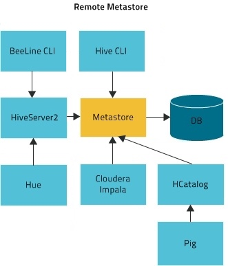

= Batch Processing

Basically automated ingest and transformation on a schedule

Two types of ingestion contents

* Deltas ingest whatever is new or has changed since last batch
* Full loads ingest the whole data set every time

The longer the batch frequency the easier it tends to be

* Constant overheads become less important
* More time to fix problems between batches

Once the batch becomes small enough ( < 5 -> 10 minutes ) we consider that micro batching,
that falls in to the steaming category and is covered in the next lesson

=== Defining Workflow of a batch process

We typically use Oozie ti define a dependecy graph of steps

Oozie is:

* A workflow system to automate batch processes
* Oozie workflows are a graph of actions
** Email Action
** Shell Action ( used more often that it should be)
** Hive 2 Action
** Sqoop Action
** Ssh Action ( needs keys, not fun )
** DistCp Action
** Spark Action
** Git Action
* Subworkflow action type enables modularization
* Oozie coordinators are schedules for workflows
** Coordinators are simplistic, many orgs use Control-M or Autosys instead

XML based, so it's very programmer centric. For better or for worse.
Each Oozie action is executed in a yarn container.
Each action when completed messages back to Oozie master

=== Transformation in batch processing

Common SQL engine for transformations is Hive

* It's Ok, but not great. It's interpreted so your optimization options are limited
* Not turning complete
* Check out "NoCOUG SQL Challenge" SQL is not always the most elegant solution

Spark SQL is also popular engine and probably better for complex ETL

* Expressive API, can mix SQL with code
* Single Spark application can incorporate an entire dependency graph
* Requires you to write a Java/Scala/Python program

Impala is for end users, not for ETL

* No fault tolerance
* few file formats
* slow writes
* no Oozie action
* just don't go there

=== Spark

The primary data processing engine of the ecosystem

We usually develop applications in spark:
* Applications made of one to many actions
* Actions made of one to many stages
* Stages made of one to many tasks

image::png/spark.png[Spark]

Spark is a distributed processing library written in Scala but ported to Java and Python

Spark runs in Yarn most of the time ( though with CDP will run on K8s as well )

There days we use Dataset/DataFrame API for structured data. Historically there was an
RDD API for any serializable objects (now largely obsolete except when dealing with non tabular objects)

=== Hive

Let's talk about out good friend Hive.

Hive is made up of 2 components

1. Hive Metastore ( HMS )
1. Hive Server 2 ( HS2 )

Hive is not a SQL execution engine, it's a codegen engine. Hive Server 2 takes query and generates
code with can run on:

* Map Reduce ( slow )
* Spark ( fast but unstable )
* Tez ( go forward technology )

So what's Hive Metastore good for?

It's stores the metadata for translating logical SQL objects like tables and databases
into physical objects like files and folders ( or Object store locations ).

Hive Metastore is shared across all engines to use SQL, including Hive, Impala and Spark SQL

=== Exercise 1

Let's start by automating the code we developed yesterday.

Write and execute an Oozie workflow that:
1. runs the sqoop job in parallel
2. than run Hive transformation

As a single workflow

Place the oozie workflow file and configuration file in labs/workflow.xml and labs/wf.conf
respectively

=== Exercises 2

Develop Spark code that performs the following transformations

1. Joins all the tables
2. saved as Parquet
3. Correct data types
4. Adds a flag attribute for gravitational waves

You can develop this code in either Scala or Python.

TIP: When developing Sacala code use the REPL to prototype your code. Don't try to compile
it every time. You will loose you mind. Once the code works in the REPL create and executable
and run with spark submit.

For SAs extra challenge do it in both languages.

Place the work source code in the file labs/spark.py or labs/spark.scala depending on which
language you chose

=== Exercises 3

Modify the Oozie from Exercises 1 to execute the Spark code rather than the Hive query

=== Exercises 4

Create an Oozie coordinator to execute the entire workflow from Exercises 3 twice a day.

Place the coordinator file in labs/workflow.cord

