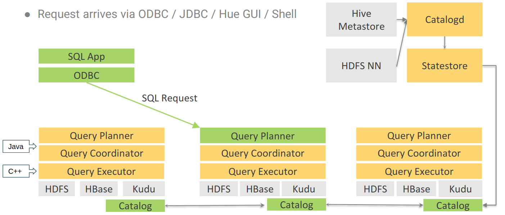
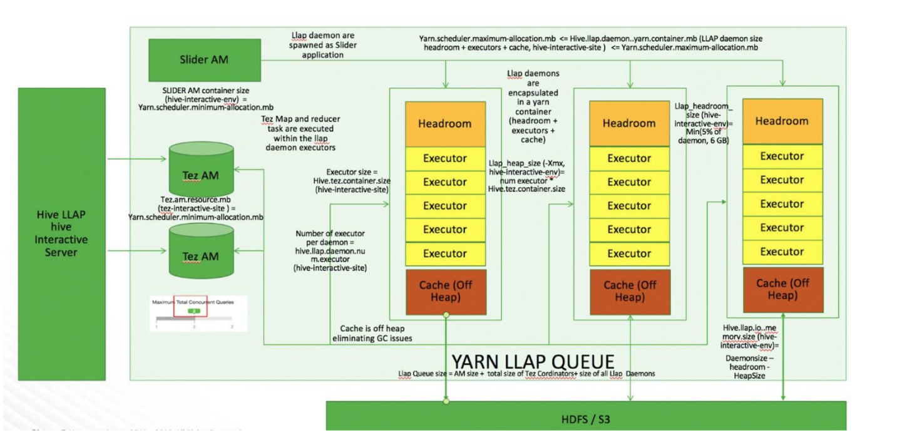
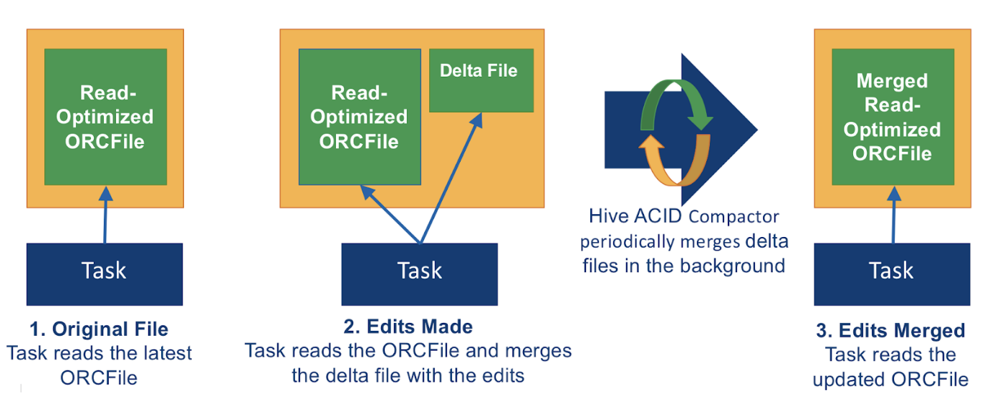

== Data Warehouse

Basically the quering of data. Once the ETL, or better said the data engineering is done,
we deploy a SQL engine to query the used data

For Data Warehouse queries we basically have 2 different tools

* Hive LLAP
* Impala

Plain old Hive on Tez will not work for a data warehouse usecase. Data warehouse needs
* Fast query results for smaller queries
* High concurrentcy as there are many users
* Ability to run large queries infrequently

=== Impala

Imapla is an link:https://en.wikipedia.org/wiki/Massively_parallel[ MPP ] SQL engine develped from scratch
in C++ with one goal in mind. Be Fast, on big data

Impala has 3 components

* Impala Demon
** The workhorse that creates the query plan, breaks it up into fragments than passes it around for all of the demons to work on in parallel
* CatalogD
** Interface to Hive metastore so metadata is in sync
* StateStore
** A private message bus for talking to demons, and for demons to talk to eachother

When working with large clusters some demons are dedicated for query planning only.
This reduces the metadata stress on the StateStore which improves scalability

=== Hive LLAP

Hive Live Long and Process is a continuation of Hive. It creates a very large YARN container
which large memory cache and executors using the cores

* The executors are running th tez compute engine
** Though it runs very different than hive on tez
* Memory cash is used for data that is being queried
** As well as cache space for running queries to compute things in memory
* LLAP will be slow with queries on data that has not been cashed
** Ideal for queries that hit the same tables over an over

LLAP is very difficult to deploy right, and runs very poorly if not correctly deployed

* LLAP is no longer available on data-center edition of CDP
** Available on public cloud as we can control that it's deployed right
** In the future will be available with private cloud
** no longer YARN based by K8s based

=== ACID Architecture

Storage layer enhanced to support MVCC (Multi-Version concurrency Control)

* 2 file types ( ORC )
** Base  : Standard immutable ORC file – stores a Baseline
** Delta : Stores the result of each change (Ex write, delete, update)
* Each row is tagged with unique ROW_ID (internal)
** Auto generated row__id column
* Changes are stored in Delta files and merged with an LSM algorithm at read time
** Multiple versions of each row to allow concurrent readers and writers though not exposed

Note you need specialized engine to query hive acid data.
* Impala will not be able to query ACID tables
* Spark can not work either without Hive Warehouse Connector
** Hive Warehouse connector is the acid aware component which allows spark to connect to hive LLAP and acid
** Basically a java ( scala compatible ) and python library
** GA in HDP 3.x Tech preview in CDP .. don't ask ...

=== Compare and contrast

Don't go there.

* Hive LLAP built at Hortonworks,
* Imapala built at legacy Cloudera

Scratch the same itch in a slightly different way.
Each can be faster in certain circumstances.

If performance matters try both, in public cloud it should take 5 minutes
Whatever is faster use that and call it a day

