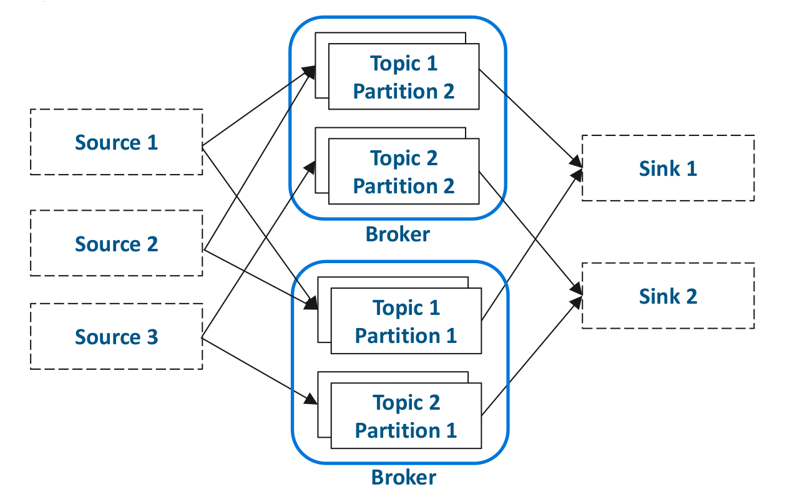
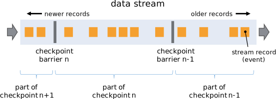

= Streaming Processing

Data in the now.

=== Introduction

Streaming discusses the automated ingest and transformation that is always running
* Usually from a queue of some kind
* Usually for events that have just happened in the real world

Important Distinction:

“Real” streams vs. micro-batches
* Streams operate on each record as they arrive
* Micro-batches operate on all records that have very recently arrived
* For many use cases the difference is negligible

Typical End to End architecture:

image::png/streaming.png[Architeture]

Let's break that into parts

=== NiFi

General purpose data integration tool

image::png/nifi.png[ nifi ]

* Works well in our stack for ingesting from upstream systems
* Pipelines defined with a GUI
* Can also do per-record processing
* Not suitable for most cross-record processing, e.g. joins, aggregations
* Primarily used for streams, but can ingest batches too
* Deployed using Cloudera Manager via separate parcel

=== Kafka

Kafka is also pub-sub messaging system, more correctly:

Kafka is a distributed, topic-oriented, partitioned, replicated commit log.
* Runs as a cluster of brokers
* Messages are held in topics
* Topics can be partitioned
* Topics can be replicated
* Every message has a strictly-ordered offset in a partition

Kafka is a passive component and does not retrieve or send any data. It just accepts requests.

=== Spark Streaming

Stream processing module for Spark

Processes arriving records in micro-batches
Typically 1 to 10 seconds, though you sould not use time frames that small

Each micro-batch is an RDD that you can process as if it was a full batch.
These days you can use structured steaming ( Spark 2.4+ ) and use the Data Frame interface.

If you want to build steaming pipelines without code, and without cost use envelope.
Careful not supported but works great, built and suppoted by a few PSAs.

http://github.com/cloudera-labs/envelope

=== Kudu

Distributed columnar data storage technology.

Deploys side by side with HDFS.

Slower than HDFS at large file scans but:

* Fast at scans and random access
* Including in-place updates and deletes
* Relational-like data model
* Tables, columns, primary key
* Avoids problems with streaming to HDFS
* Avoids issues with small files, duplicates, metadata refreshes,
  visibility latency

=== Exercise 0 - Preparation

Time to build a steaming pipeline for our gravitational wave detector.

To create at steam of data use the generator available in github:
link:http://tiny.cloudera.com/gravity-generator[Data Generator].

To run the downloaded jar the syntax is:

....
java -cp bootcamp-0.1.0.jar com.cloudera.fce.bootcamp.MeasurementGenerator <hostname> <port>
....

To view the data steam you can use the `nc` command

=== Exercise 1

Use NiFi to create a pipeline where the generated data is inserted into Kafka

You want to make sure the data is unchanged in the process.

Take a screenshot of relevant part of your canvas and put into labs/nifi.png

=== Exercises 2

Modify the spark steaming job developed developed yesterday to ingest data from Kudu
rather than HDFS. Leave the rest of the transformations the same.

Use CSVReader for Record Reader when reading the data from Kafka
Use MergeContent for creating right-sized files on HDFS

Place the new version of the code in the file labs/spark.py or labs/spark.scala
depending of the programing language you chose

=== Exercises 3

Modify the code from the previous exercise to insert into Kudu rather than an HDFS table.

When inserting the data into kudu use the following schema
link:http://tiny.cloudera.com/measurements.avsc[ Schema ]

Place the new version of the code in the file labs/spark.py or labs/spark.scala
depending of the programing language you chose

=== Bonus Exercises

If you have time, try to use Envelope to build the spark pipeline.

Place the workflow file in labs/envelope.conf