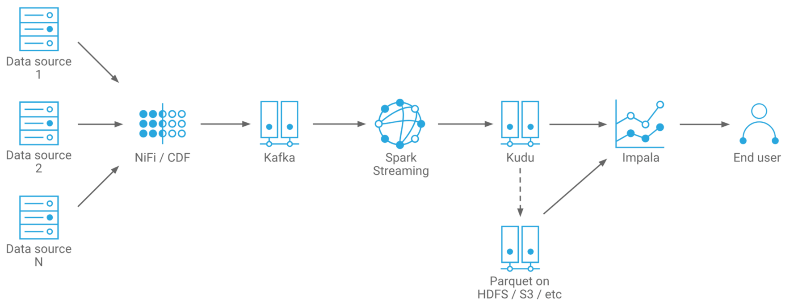
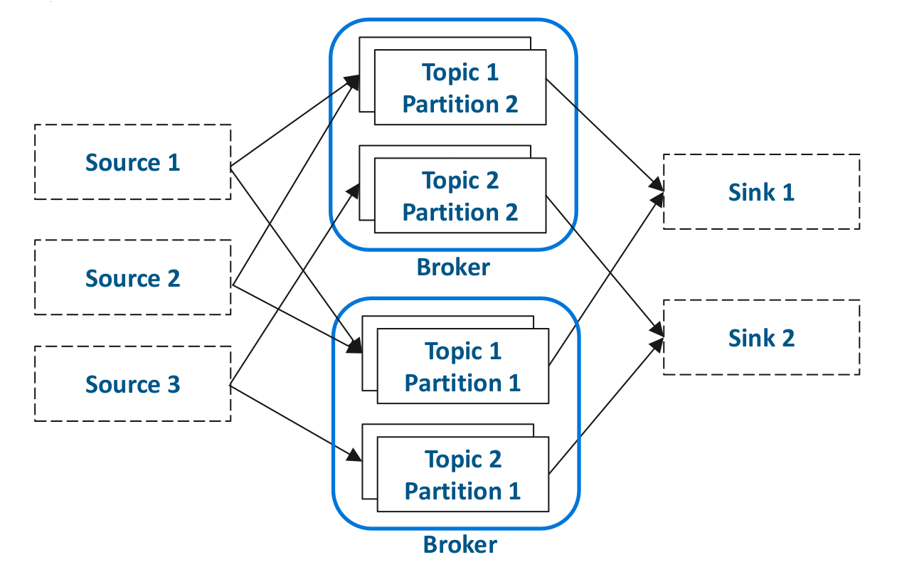
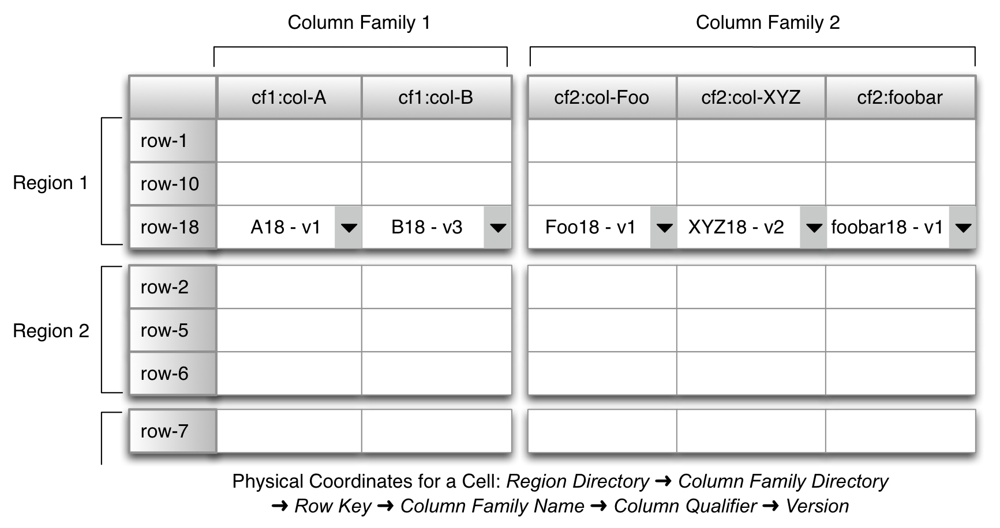
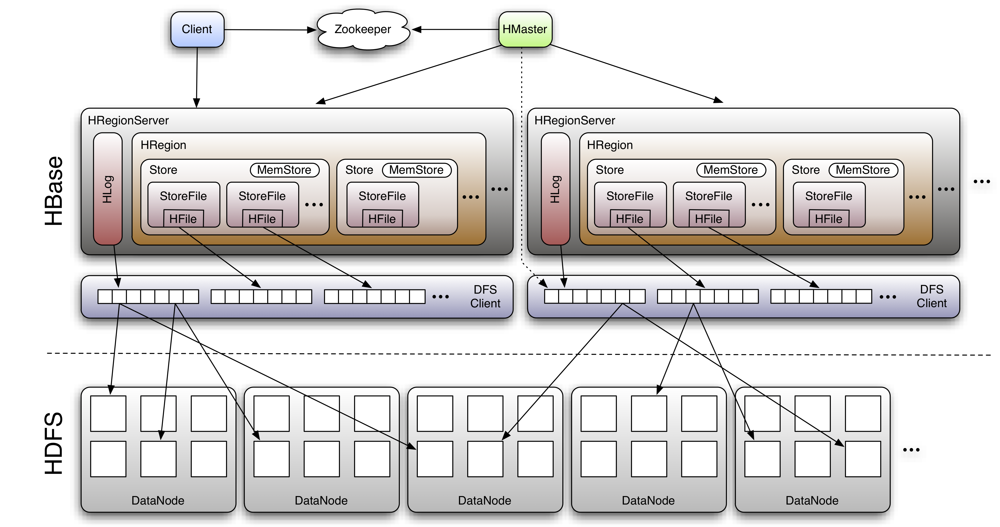

= Streaming Processing

Data in the now.

=== Introduction

Streaming discusses the automated ingest and transformation that is always running
* Usually from a queue of some kind
* Usually for events that have just happened in the real world

Important Distinction:

“Real” streams vs. micro-batches
* Streams operate on each record as they arrive
* Micro-batches operate on all records that have very recently arrived
* For many use cases the difference is negligible

Typical End to End architecture:

Let's break that into parts

=== Kafka

Kafka is also pub-sub messaging system, more correctly:

Kafka is a distributed, topic-oriented, partitioned, replicated commit log.

* Runs as a cluster of brokers
* Messages are held in topics
* Topics can be partitioned
* Topics can be replicated
* Every message has a strictly-ordered offset in a partition

Kafka is a passive component and does not retrieve or send any data. It just accepts requests.

=== Kudu

Distributed columnar data storage technology.

Deploys side by side with HDFS.

Slower than HDFS at large file scans but:

* Fast at scans and random access
* Including in-place updates and deletes
* Relational-like data model
* Tables, columns, primary key
* Avoids problems with streaming to HDFS
* Avoids issues with small files, duplicates, metadata refreshes,
  visibility latency

=== HBase

HBase is a key-value store, one of the originators of the No-SQL world.

* But don't tell it its a key value store, they use the table model.
* Each table have rows, but each row can have a variable number of columns
* Each cell is a key value pair when physically stored, with row and column name as key, and content as value
** It's more complicated than that more details link:https://medium.com/@ajaygupta.hbti/design-principles-for-hbase-key-and-rowkey-3016a77fc52d[for the brave]
* Important each cell has a timestamp stamp which determine what is the latest value of that cell
** All updates are just appends of new data, upon read value with the highest timestamp is retrieved
** You can get previous versions if you want, but default is latest
* All data is stored sorted by key ( and timestamp ), so sequential rows are sequentially stored
** Very fast cell lookup ( a few milliseconds )
** Very fast short scans ( as the data is sequentially stored )
** Very fast updates, just an apend to bottom
* Ignore column family, don't use it, it does more harm than good.
** Well have a single letter column family for everything.

=== HBase Architecture

HBase worker ( Region Server ) is composed of:

* MemStore
** In memory store of new inserts / updates kept in a sorted b-tree structure.
* BlockCache
** Read blocks are stored in memeory for quick access
* HFile
** When the memstore is full ( per table ) it spills to a file called an HFile in HDFS
** Some of all HFiles is all of the data for a table

Compaction is important. HFile can be small usually <100 MB, for a table of TB is size that is a problem.

* Minor Compaction
** joins small HFiles but does not deal with deletes as it does not look at all files
** Can not be stopped will happen periodically, but are stop gaps until major compactions
* Major Compaction
** Happens on schedule, schedule when the cluster is quite.
** Will process all HFiles for a table. Can clean up deletes and leaves things very clean

That is basically how you build an update intensive system on a read only filesystem.
