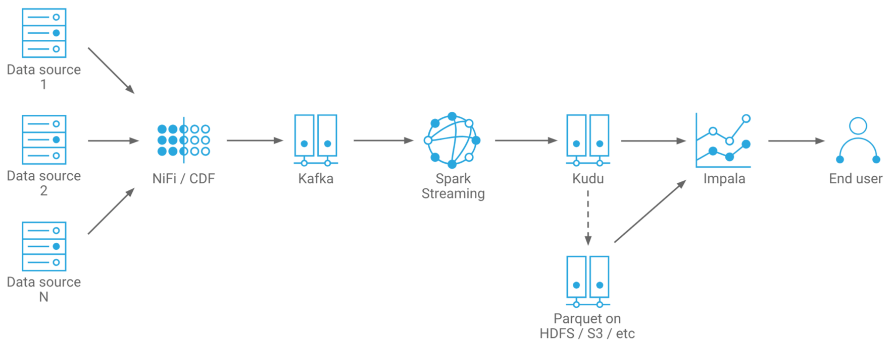

= Streaming Processing

Data in the now.

=== Introduction

Streaming discusses the automated ingest and transformation that is always running
* Usually from a queue of some kind
* Usually for events that have just happened in the real world

Important Distinction:

“Real” streams vs. micro-batches
* Streams operate on each record as they arrive
* Micro-batches operate on all records that have very recently arrived
* For many use cases the difference is negligible

Typical End to End architecture:

Let's break that into parts

=== Kafka

Kafka is also pub-sub messaging system, more correctly:

image::png/kafka.png[ Kafka ]

Kafka is a distributed, topic-oriented, partitioned, replicated commit log.
* Runs as a cluster of brokers
* Messages are held in topics
* Topics can be partitioned
* Topics can be replicated
* Every message has a strictly-ordered offset in a partition

Kafka is a passive component and does not retrieve or send any data. It just accepts requests.

=== Kudu

Distributed columnar data storage technology.

Deploys side by side with HDFS.

Slower than HDFS at large file scans but:

* Fast at scans and random access
* Including in-place updates and deletes
* Relational-like data model
* Tables, columns, primary key
* Avoids problems with streaming to HDFS
* Avoids issues with small files, duplicates, metadata refreshes,
  visibility latency

=== HBase

